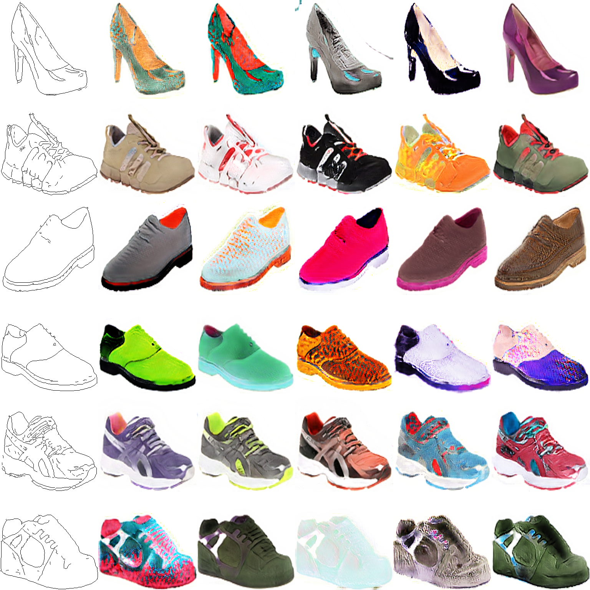

# BicycleGAN in `pytorch`
This an implementation of [Toward Multimodal Image-to-Image Translation](https://arxiv.org/abs/1711.11586).

## Requirements
1. pytorch 1.0
2. numpy, Pillow, opencv

## How to reproduce my results

1. Download `edges2shoes` dataset from [here](https://github.com/junyanz/pytorch-CycleGAN-and-pix2pix/blob/master/docs/datasets.md#pix2pix-datasets).
2. Edit the path in `train.py` file and run it.

You can also download my trained models from [here](https://drive.google.com/drive/folders/1LE1VGs4ir5bClgtby94G5_IYoDzLL5Qp?usp=sharing) (run01.tar.gz).  
You can try them using `inference/test.ipynb`.

## Notes

1. For the generator I use resnet-like architecture not unet (like they do in the original paper).
2. I insert style information into the generator using AdaIN layers (like in StyleGAN).
3. I feed into the generator not only edges but also a binary mask.
4. I also use the binary mask to mask the outputs of the discriminators.

## Examples

## Acknowledgments

This code is inspired by

1. [junyanz/BicycleGAN](https://github.com/junyanz/BicycleGAN)
2. [eveningglow/BicycleGAN-pytorch](https://github.com/eveningglow/BicycleGAN-pytorch)
3. [NVlabs/MUNIT](https://github.com/NVlabs/MUNIT)

## Other relevant papers

1. [A Style-Based Generator Architecture for Generative Adversarial Networks](https://arxiv.org/abs/1812.04948)
2. [Multimodal Unsupervised Image-to-Image Translation](https://arxiv.org/abs/1804.04732)
3. [Semantic Image Synthesis with Spatially-Adaptive Normalization](https://arxiv.org/abs/1903.07291)
4. [Latent Filter Scaling for Multimodal Unsupervised Image-to-Image Translation](https://arxiv.org/abs/1812.09877)
