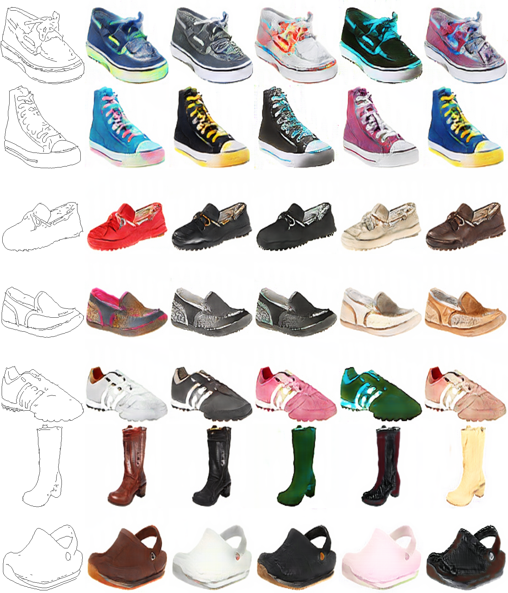

# BicycleGAN in `pytorch`
This an implementation of [Toward Multimodal Image-to-Image Translation](https://arxiv.org/abs/1711.11586).

## Requirements
1. pytorch 1.0
2. numpy, Pillow, opencv

## Credit

dd220a94f3e84b0b6dea05fda277d905c61051a4

https://github.com/eveningglow/BicycleGAN-pytorch
https://github.com/junyanz/BicycleGAN
https://github.com/NVlabs/stylegan

A Style-Based Generator Architecture for Generative Adversarial Networks
https://arxiv.org/abs/1812.04948

Toward Multimodal Image-to-Image Translation
https://arxiv.org/abs/1711.11586

Semantic Image Synthesis with Spatially-Adaptive Normalization
https://arxiv.org/abs/1903.07291

Latent Filter Scaling for Multimodal Unsupervised Image-to-Image Translation